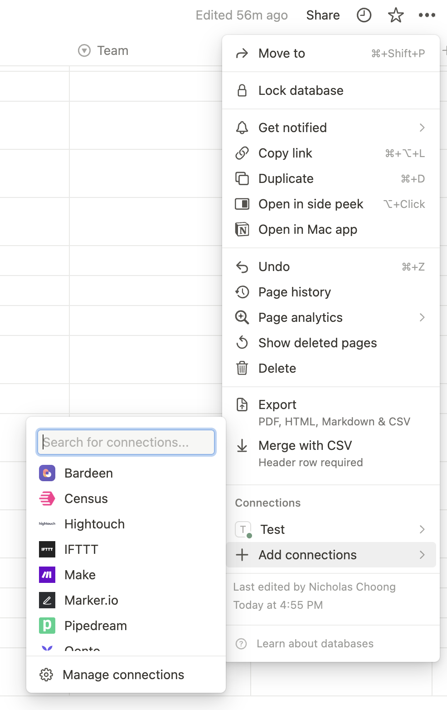

# JSON to Notion TypeScript Script

This document provides step-by-step instructions for setting up and running a TypeScript script that transfers data from a JSON file to a Notion database. Follow these instructions to get your project up and running.

## Step 1: Obtain Notion API Key

Get the Notion API key [here](https://www.notion.so/my-integrations). You'll need this key for authentication.

## Step 2: Get Notion Database ID

Share your Notion database and extract the database ID from the shared URL. You will use this ID to interact with your Notion database programmatically.

    https://www.notion.so/fer6ff3d5fcs3dff1d2134349192cc?v=4rf43545...
                         |---------Database ID----------|

## Step 3: Add Notion API Integration to your database

In your Notion workspace, add the integration to your target database. Make sure to configure the appropriate permissions (read and write access) for the integration.



## Step 4: Install Packages

Use the following command to install the necessary packages for your TypeScript script:

```bash
pnpm install
```

## Step 5: Download XLSX File from Google Docs

Download the XLSX file from your Google Docs, which contains the data you want to transfer to Notion.

## Step 6: Clean the XLSX File

Perform any necessary data cleaning or formatting on the downloaded XLSX file to ensure that it's ready for conversion to JSON.

## Step 7: Convert XLSX to CSV

Use your preferred method or library to convert the cleaned XLSX file to a CSV file.

## Step 8: Convert CSV to JSON

Use an online service or a library (e.g., [convertcsv.com](https://www.convertcsv.com/csv-to-json.htm)) to convert the CSV file to a JSON file. Name the JSON file starting with "applicants."

## Step 9: Place JSON File in src Folder

Move the generated JSON file to the `src` folder in your project directory.

## Step 10: Configure projectConfig.ts

Open the `projectConfig.ts` file and set the project season and project info according to your project requirements.

## Step 11: Update main.ts

In the `main.ts` file, locate lines 38 and 52 and change the project season as needed.

## Step 12: Run the Script

Run the script using the following command:

```bash
pnpm exe
```

This will execute your TypeScript script and transfer the data from the JSON file to the configured Notion database.

EZ
